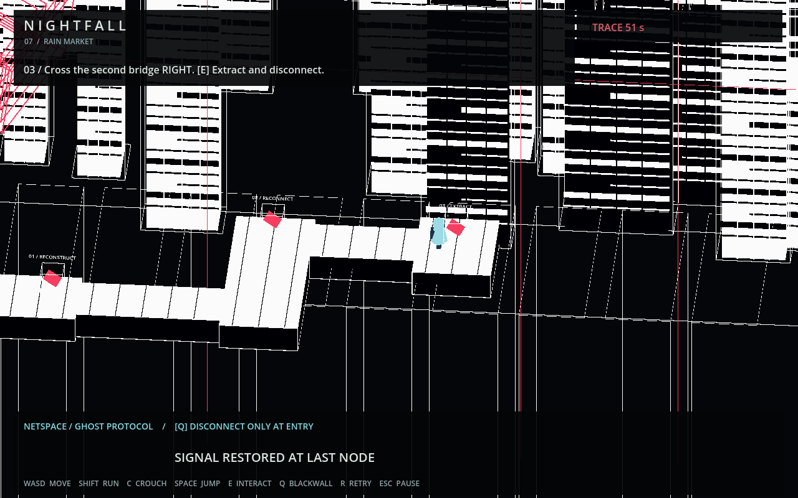

# Ghost Protocol — demo handoff

## 给继续开发的朋友

这是独立 Godot 4.4.1 3D 原型，不替换现有 Phaser 关卡，也不包含或合并 PR #2 的 Chapter 2 修改。

### 启动

1. 安装 Godot 4.4.1 标准版（不需要 .NET）。引擎本体不包含在仓库内。
2. 在 Godot 导入本目录 `project.godot`，按 F5。macOS 也可在安装 Godot 到 Applications 后双击 `Play.command`。
3. Enter 开始；WASD/方向键移动，Shift 跑，C 蹲，Space 跳，E 交互，Esc 暂停，R 从头重试。

### 完整试玩路线

起点附近青色终端 → E 接入 → 右走到红色节点 01，E 重组桥面 → 过桥后向上到节点 02，E 接通第二座桥 → 在 55 秒内向右到核心，E 取钥匙并返回现实 → 躲避街巷守卫，跑到最右侧闸门按 E 逃离。

掉落会回到最近节点并保留解谜进度。Q 只能在入口锚点附近主动退出网络，不能随处逃避倒计时。

### 视觉方向

墙外：雨夜、霓虹、普通赛博朋克街巷，不是诊所。

墙内：参考《边缘行者》Lucy 黑客空间的黑白高反差几何块、密集正交线框、嵌套纵深；人物保留冷色，红色只用于少量节点与定位线。不能退回“红黑版同一条街”的做法。当前几何和人物均为原型，不含动画截图或录屏资产。

### 代码入口

- `blackwhite.tscn` / `blackwhite.gd`：当前主场景、网络几何、两座桥、接入/返回与钥匙状态。
- `ward.gd`：复用的角色、街巷移动、守卫、躲藏、音效和 UI 基础。
- `city.gd`：街巷建模。
- `ward.tscn`：旧版本保留用于对照，不是当前启动场景。
- `bake.gd`：仅重建旧 `ward.tscn`，运行会覆盖其中的手工场景修改；不要用它保存新网络场景。

### 已验证与边界

新流程 16 项检查通过，包含按键行走过两座桥、暂停、掉落恢复、返回、开门、胜利与追踪超时。命令：

```sh
godot --headless --path godot-demo --script test_blackwhite.gd
```

去掉 `--headless` 可生成 `preview-net-new.png`。旧版 `tests.gd` 的 16 项逻辑检查也通过；旧测试在无窗口退出时有 ObjectDB 清理警告，未把它当成完全无警告的测试。

目前是短线性玩法验证，不是完整分支迷宫；网络敌人为可见逼近线框加倒计时，尚无独立寻路 AI。未接入 Phaser 存档、章节切换或最终发布包。

### 推荐下一步

先试玩确认路径与角色可读性，再加入一处分支接线选择；随后让追踪者沿玩家接通的路径行动。最后再细化模型、镜头与动画。不要先扩成大地图。


